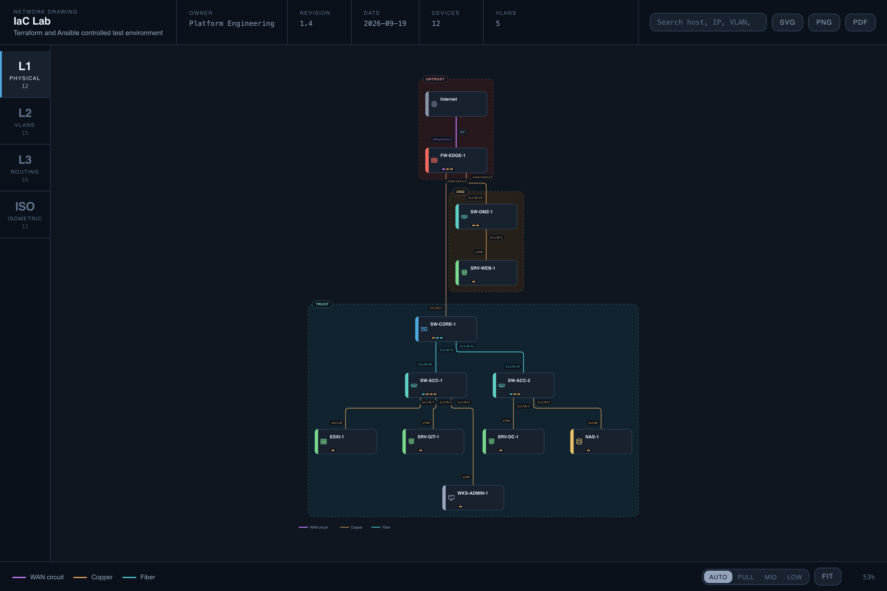
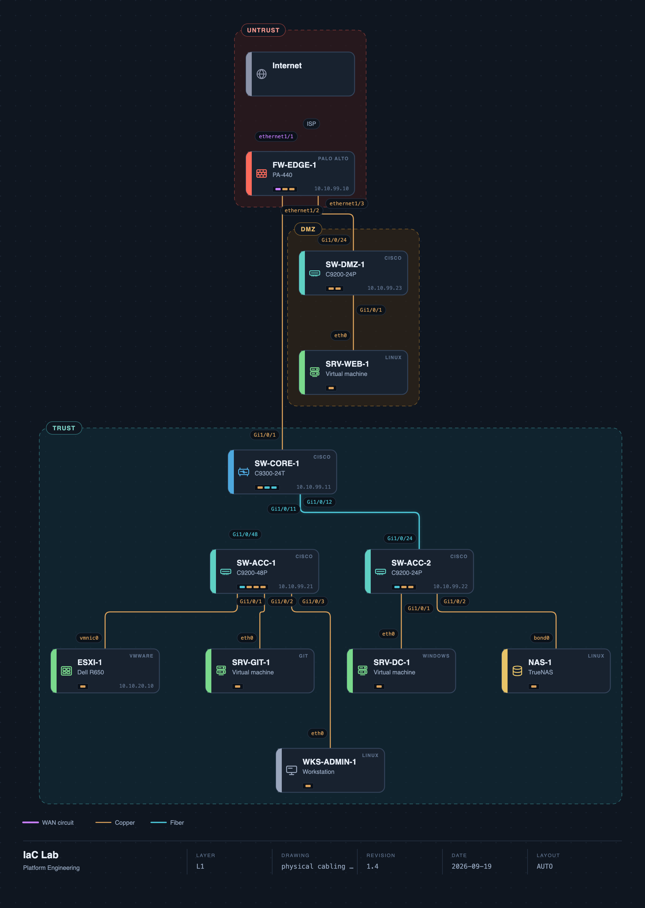
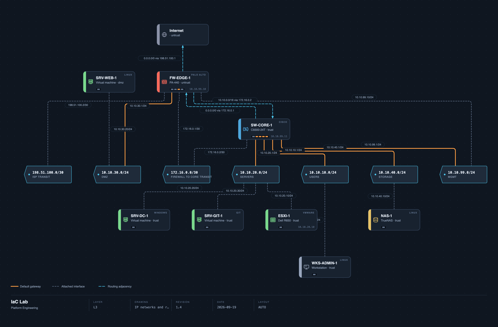
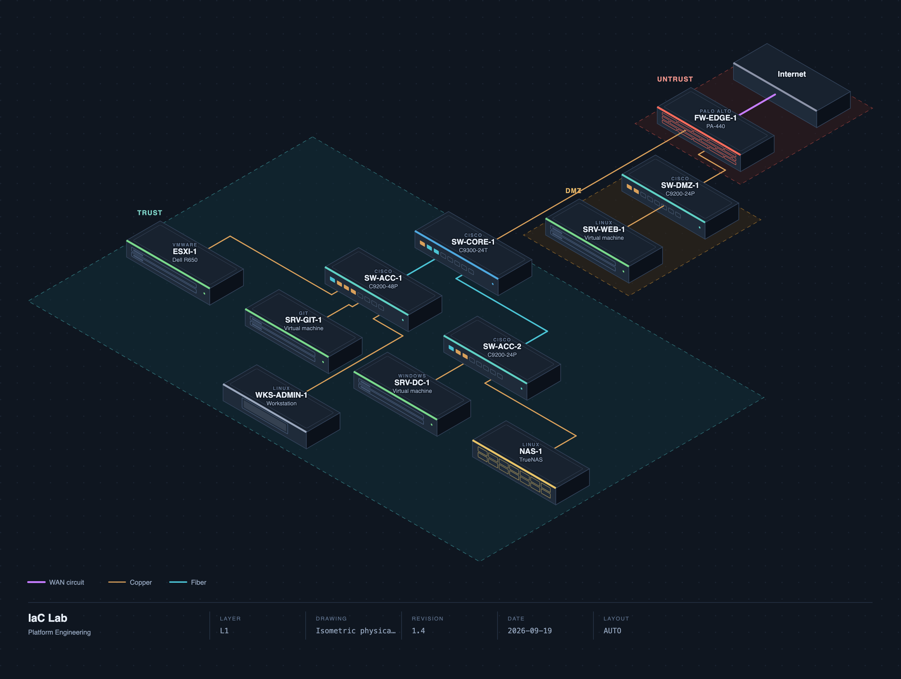
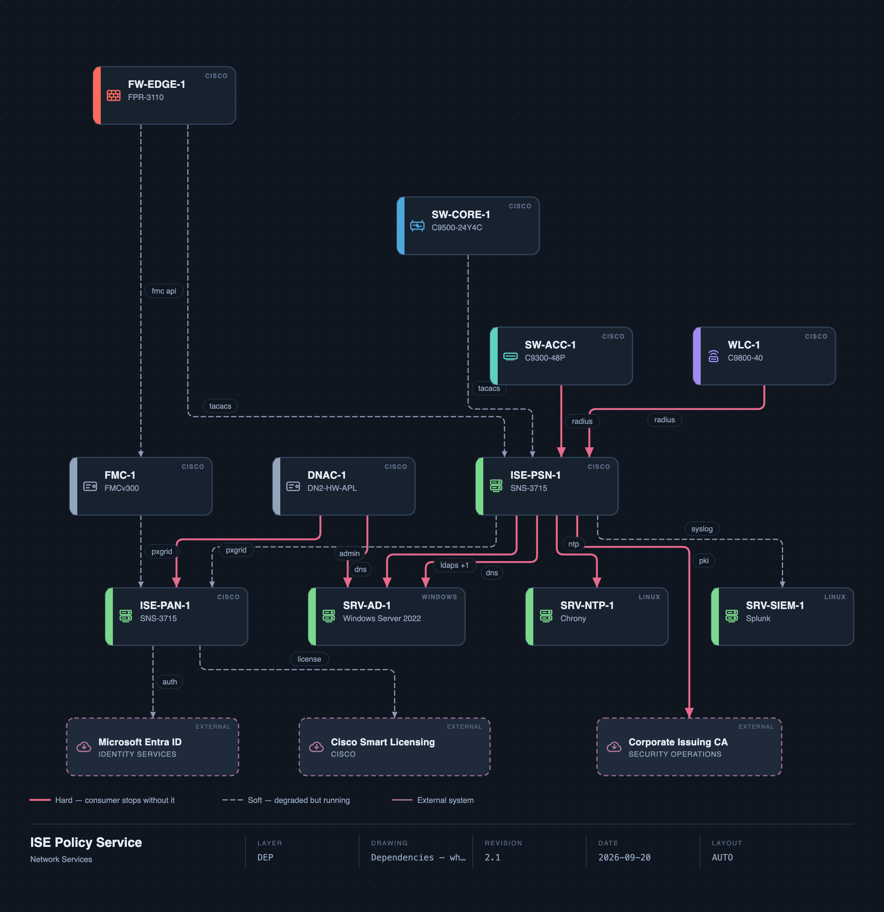

# netlas

Generate L1, L2 and L3 network diagrams from declarative models — and link many
of them together in a visual Studio.

[](https://github.com/cappern/netlas/actions/workflows/ci.yml)
[](LICENSE)



netlas does two things:

1. **Generate** — one YAML file describes a network once; netlas derives the
   three OSI layers from it, lays them out automatically, and renders them as
   standalone SVG or a self-contained interactive HTML viewer with an optional
   stacked 3D view. Headless, CI-friendly, no server.
2. **Studio** — a local SvelteKit app where you add, edit and **link** several
   designs into a portfolio, so a device in one diagram can drill straight into
   another diagram. Editing a design's YAML re-renders it live.

```bash
git clone https://github.com/cappern/netlas.git
cd netlas
npm install
npm run build:3d          # once, and after any change to src/lib/core/render3d/

# Generate a single design (headless)
node bin/netlas.ts render examples/iac-lab.netlas.yaml -o out/lab.html

# Open the Studio on the example portfolio
npm run studio            # http://localhost:5173
```

## One model, five views

Every diagram below is derived from a single YAML file — change a fact once and
each view updates together.

| L1 — physical | L3 — routing |
|---|---|
| [](docs/images/l1.png) | [](docs/images/l3.png) |
| **ISO — isometric** | **DEP — dependencies** |
| [](docs/images/iso.png) | [](docs/images/dep.png) |

## Why one model

Most network documentation drifts because the physical diagram, the VLAN table
and the IP plan are three separate drawings maintained by hand. In netlas they
are three views of one model:

| Layer | Derived from | Shows |
|---|---|---|
| L1 | `devices` + `links` | Cabling, ports, media, LAGs |
| L2 | interface VLAN membership | Broadcast domains, trunks, SVIs |
| L3 | interface IPs + `routing` | Networks, gateways, VRFs, adjacencies |
| ISO | same graph as L1 | The same cabling as an isometric floor plan |
| DEP | `dependencies` | What each system needs to keep working |

Change a trunk's VLAN list and all three layers update together, because there
is nowhere else for the fact to live.

## Commands

```
netlas validate  <model.yaml> [--json]
netlas svg       <model.yaml> --layer l1|l2|l3|dep [-o file.svg] [--theme <id>] [--detail <level>]
netlas iso       <model.yaml> [-o file.svg] [--theme <id>] [--detail <level>]
netlas render    <model.yaml> [-o file.html] [--theme <id>] [--no-3d] [--no-iso]
netlas freeze    <model.yaml> [--layer l1|l2|l3|dep|all] [--reset]
netlas workspace <dir> [-o out-dir] [--theme <id>] [--no-3d] [--no-iso]
netlas themes
```

`validate` exits non-zero on error, so it drops straight into CI. `workspace`
renders every design in a portfolio to a self-contained HTML file plus an
`index.html`, wiring the cross-design links as jumps between the files.

## Claude Code skill

The repo ships a [Claude Code](https://claude.com/claude-code) skill at
`.claude/skills/netlas/`, so anyone who clones can ask Claude to author,
validate and render netlas models in plain language. It is discovered
automatically when you work in the repo — describe a network ("draw a branch
with a firewall, a core switch and two access switches") and Claude writes a
valid model, validates it, and renders it with the CLI. Run `/netlas` to invoke
it directly. The skill teaches the model schema (`SKILL.md` for the workflow,
`reference.md` for every field and enum), so its output stays valid.

## The model

```yaml
meta:   { title: IaC Lab, owner: Platform Engineering, version: "1.4", theme: signal }
sites:  [{ id: lab, kind: lab }]
zones:  [{ id: trust, kind: trust }, { id: dmz, kind: dmz }]

vlans:
  - { id: 20, name: SERVERS, subnet: 10.10.20.0/24, gateway: 10.10.20.1, zone: trust }

devices:
  - id: sw-core-1
    role: core                 # role drives the vertical tier and the glyph
    vendor: cisco
    model: C9300-24T
    zone: trust
    interfaces:
      - { name: Gi1/0/11, mode: trunk, vlans: [10, 20, 99], native_vlan: 99 }
      - { name: Vlan20,   mode: svi,   ip: 10.10.20.1/24 }

links:
  - { a: "sw-core-1:Gi1/0/11", b: "sw-acc-1:Gi1/0/48", media: fiber, speed: 1G }

routing:
  - { from: sw-core-1, to: fw-edge-1, kind: default, detail: "0.0.0.0/0 via 172.16.0.1" }
```

Roles: `internet wan router firewall loadbalancer core distribution access
wireless server hypervisor storage container service client appliance`.
Media: `copper fiber virtual wireless wan console`.

Three worked examples ship with the project:

| File | Scale | Purpose |
|---|---|---|
| `examples/iac-lab.netlas.yaml` | 11 devices | A lab: Palo Alto and Cisco firewalls, Cisco switches, Windows and Linux servers, a hypervisor, a Git host |
| `examples/enterprise-dc.netlas.yaml` | 59 devices, 68 links, 16 VLANs | A redundant data centre: dual WAN, HA perimeter, two cores, four distribution and four leaf switches, twelve access switches, hypervisors, storage, DMZ |
| `examples/ise-dependencies.netlas.yaml` | 11 devices, 3 externals, 17 dependencies | A Cisco ISE policy service and everything that leans on it |

The larger example exists to exercise layout, labelling and zoning at scale;
it is covered by its own test file.

## Validation

The schema catches typos; the semantic checks catch the mistakes that actually
produce wrong diagrams:

- a link to a device or interface that does not exist
- one physical port terminating two cables
- a VLAN used on an interface but never declared
- overlapping subnets
- a gateway outside its own subnet
- an interface IP in a network nobody declared
- devices with no links, which would float in L1

Errors block rendering. Warnings are reported and surfaced in the viewer.

## Layout: automatic, then yours

Layout is automatic by default. Nodes are partitioned into tiers by role, so
the drawing reads top-to-bottom the way an engineer thinks rather than the way
a graph solver would arrange it.

Node spacing is set wide enough that two neighbouring devices in different
security zones leave a visible gutter between their zone boxes — zones that
touch read as one merged region.

A tier wider than eight devices is wrapped onto extra rows. A server farm is
one tier by role, and drawing two dozen hosts as a single row produces a
diagram several times wider than it is tall, legible only by panning. Members
are ordered by their upstream neighbour before wrapping, so the hosts on one
leaf switch stay together instead of being scattered by declaration order. The
isometric view inherits this for free, because it derives its rows from the
flat layout.

When automatic placement is not good enough:

```bash
netlas freeze model.yaml --layer l1     # writes coordinates into layout:
netlas freeze model.yaml --reset        # back to automatic
```

`freeze` writes the solver's chosen coordinates back into the model, where you
can edit them by hand. The model stays the single source of truth and the diff
shows exactly which nodes a human moved. A frozen layout that no longer covers
every node fails loudly rather than silently dropping devices.

## Dependencies

L1, L2 and L3 answer "what is this connected to". They do not answer the
question someone actually asks at 03:00, which is "if this box is down, what
stops working". That fact lives nowhere in a cabling diagram, so it gets its
own block and its own layer:

```yaml
externals:
  - { id: entra, label: Microsoft Entra ID, kind: identity, owner: Identity Services }

dependencies:
  - { from: sw-acc-1, to: "ise-psn-1:radius", kind: auth, strength: hard,
      description: 802.1X and MAB on every access port }
  - { from: ise-psn-1, to: "srv-ntp-1:ntp", kind: ntp, strength: hard }
  - { from: ise-pan-1, to: entra, kind: auth, strength: soft }
```

An endpoint is a device, an external system, or `<id>:<service>` naming one of
the services that device already declares. `externals:` exists so that Entra
ID, a vendor SaaS or a central directory can be an endpoint without becoming a
device that floats, unlabelled and uncabled, in the L1 drawing.

`strength` is required. `hard` means the consumer stops; `soft` means it
degrades. There is deliberately no default: defaulting to `hard` would make
every blast radius over-report, and defaulting to `soft` would hide the
outage. It is one word, and it is the word that carries the meaning.

The DEP layer draws consumers above providers with the arrow pointing at what
is needed. Several services between the same pair — LDAPS and Kerberos to the
same directory — collapse into one edge labelled `ldaps +1`, the same way
parallel cables collapse into a LAG, because two edges between the same two
boxes are routed onto the same line and draw on top of each other.

The tab and the file appear only when the model declares dependencies. An
empty dependency diagram is not an empty drawing, it is a claim that nothing
depends on anything.

Clicking any device, on **any** layer, lists **Used by** and **Depends on**
with the service, the strength and the reason, and each entry jumps to that
system on the DEP layer. Those are direct neighbours only. Following the chain
further and presenting the result as fact would give an inference the same
weight as something a human actually wrote down.

Validation refuses a dependency on a system or a service that is not declared,
a system that depends on itself, and an id shared between a device and an
external — the two share one namespace, so a collision makes the endpoint
ambiguous. A cycle of hard dependencies is a warning, not an error: mutual
dependencies are real, and the drawing's job is to show that nothing in the
cycle can start without the rest.

## Studio and workspaces

One diagram answers "how is this network built". A real estate of networks
raises a second question — "where does this one hand off to that one" — and
that fact belongs between designs, not inside any one of them. A **workspace**
is a folder of designs plus the links between them:

```
examples/portfolio/
  workspace.netlas.yaml     manifest: which designs, and how they link
  iac-lab.netlas.yaml       an ordinary netlas model
  ise.netlas.yaml           another ordinary netlas model
```

```yaml
# workspace.netlas.yaml
name: Lab Portfolio
designs:
  - { id: iac-lab, file: iac-lab.netlas.yaml, title: IaC Lab }
  - { id: ise,     file: ise.netlas.yaml,     title: ISE Dependencies }
links:
  - from: iac-lab:sw-acc-1   # a device or external in one design …
    to: ise                  # … drilling into another design
    kind: drilldown
    description: Access switch authenticates against the ISE deployment
```

A link's `from` is `<designId>:<nodeId>` and its `to` is another design's id.
Nothing about the single-design model changes — the manifest is a thin layer
over ordinary, independently valid designs, so each still renders and validates
on its own.

The **Studio** is the visual front end for a workspace:

```bash
NETLAS_WORKSPACE=examples/portfolio npm run studio   # defaults to examples/portfolio
```

- An **overview** lists every design with its device and VLAN counts and shows
  the links between them.
- Opening a design gives the same L1/L2/L3/DEP/ISO tabs, pan and zoom, and
  click-to-inspect as the static viewer, driven from the same core renderers.
- The **link editor** ties a node to another design. A linked node shows a
  "Links to" affordance in the inspector, and clicking it navigates to that
  design — the portfolio walked hop by hop.

Export the whole portfolio to static HTML with `netlas workspace <dir>`; the
cross-design links become `<a href>` jumps between the emitted files.

### Editing

Press **Edit** to turn a design into a live canvas. The whole derive → layout →
render pipeline runs in the browser, so every change repaints instantly with the
same renderer the export uses — the drawing you edit is the drawing you ship.

- **Layouts** — placement is automatic by default (the **Auto** layout, ELK),
  and Auto owns its own positions, so nodes are not draggable. Switch the
  **Layout** control to a named layout — or add one — to unlock free dragging;
  hand-placed coordinates are then stored in that layout. Each design chooses
  which layout renders outside the Studio (**Set default**), so Auto stays the
  default and manual arrangements are opt-in and never accidental.
- **Move** — with a manual layout active, drag any node; the diff shows exactly
  what a human moved. (`netlas freeze` does the same thing from the CLI.)
- **Connect** — drag from a node's knob to another node to lay a cable. The new
  link is routed by the layout engine, so it looks like every other cable.
- **Add** — the palette adds a device by role; drop it, then wire it up.
- **Delete** — select a node or link and press Delete (or use the inspector).
  Deleting a device takes its cables with it.
- **Properties** — selecting a device opens an editor for its identity, site,
  zone and interfaces; the **Model** panel edits the collections that aren't on
  the canvas: sites, zones, VLANs, subnets and dependencies.

Enum fields (role, vendor, interface mode, zone kind, dependency strength) are
dropdowns drawn from the schema, so an edit can't drift out of the contract.
**Save** validates the whole model and writes YAML only if it still loads —
an invalid edit is reported, never persisted.

The Studio's live design view covers L1/L2/L3/DEP and the isometric L1. The
stacked WebGL 3D view currently ships only in the self-contained HTML export
(`netlas render` / `netlas workspace`), not yet in the live Studio.

## Themes

```
signal      dark    NOC console. Cable-code accents on blue slate.
blueprint   dark    Cyanotype construction drawing. Hairlines, no fills.
paper       light   Print and PDF. Cool stock, two-ink as-built markup.
graphite    light   Monochrome. Meaning carried by weight and dash, not hue.
aurora      dark    Presentation. Glass cards, luminous links, deep indigo.
```

Link colour follows the patch-cable code in every theme, so fiber, copper and
WAN keep their real-world identity. `graphite` deliberately drops hue and
encodes media as dash pattern and line weight instead, for black-and-white
printing and for audits where colour would imply meaning the model does not
carry.

## Isometric L1

`netlas iso` draws the physical layer as a 2.5D floor plan: devices are slabs
standing on their security zone's floor plate, cables run through the space
between them, and a painter's-algorithm depth sort makes a slab in front hide
the cable behind it. It is ordinary SVG, so it prints and exports like every
other layer.

Placement is its own compact grid rather than a reprojection of the flat L1
layout. Projecting the flat layout directly is the obvious approach and it
looks wrong: the diagonal projection stretches a tiered drawing across a
bounding box that is mostly empty. The grid keeps the two facts that carry
meaning — which tier a device sits in, and its left-to-right order within that
tier — and drops only the pixel spacing, which carried none.

It is a projection of the flat layout — the same node positions and the same
cable routes, scaled to 0.8. That matters more than it sounds. An earlier
version re-placed nodes on its own grid and routed cables with a naive
two-segment router, and 70% of cable segments ended up crossing a chassis they
had nothing to do with. ELK already routes orthogonally around obstacles, so
reprojecting brings that to zero.

Devices wear a real chassis rather than a flat icon. Detail is drawn *into*
the isometric faces through a transform in face-local units, so a switch shows
a port row coloured by each cable's actual media, a firewall shows brick
courses, a server shows drive bays and storage shows drive carriers. A 2D glyph
pasted onto a 3D solid is what makes a drawing look assembled rather than
designed, so there isn't one — role is carried by the shape of the box.

The port row reads from the same `usedPorts()` the flat view's port strip uses,
so the faceplate and the strip cannot drift apart.

Zone floor plates are drawn only when they do not overlap. Grid rows follow
tiers, not zones, so a zone's members are not always contiguous; two
overlapping plates would claim a device stands in both zones at once. When
that happens the plates are dropped and each slab carries its zone as text.

Labels stay screen-aligned. Skewing text into the isometric plane looks clever
in one screenshot and is unreadable everywhere else.

## Level of detail

Large diagrams carry detail that is only meaningful up close. netlas can drop
it, in the viewer through the **Auto / Full / Mid / Low** control, and in a
static export through `--detail`.

| Level | Dropped |
|---|---|
| `full` | nothing |
| `mid` | vendor marks, secondary text, the glow filter |
| `low` | + chassis detail, port strips, port-name chips |

The rule for what may be dropped is not taste: an element qualifies only when
it is already illegible at the zoom that triggers the level. A 7.5px vendor
mark has gone by 85% zoom; a port is a smudge below 45%. The device name, its
role colour, the cable media colour and the topology are never dropped, so
nothing a reader could actually have read is taken away — there is a test for
exactly that.

It is also the cheapest performance lever in the project. On the 59-device
example, dropping to `low` takes the visible layer from 1633 painted elements
to 833 and from 350 text elements to 66, and `mid` alone switches off 61
Gaussian-blur filters — an SVG filter is re-rasterised on every repaint. In
the viewer `Auto` follows the zoom, and picking a level pins it.

Static exports shrink accordingly: the enterprise L1 goes 177 KB → 79 KB.

## Viewer

`netlas render` produces one HTML file with no external requests — no CDN, no
web fonts, no network at all. It opens from a USB stick in a plant room.

Tabs for L1, L2, L3, DEP, ISO and 3D; pan and zoom; a level-of-detail control;
click-to-inspect on both devices and links; search across hostnames, IPs,
VLAN ids and port names; SVG and PNG export; and print-to-PDF.

Links are clickable, and the inspector says something true for the layer you
are on rather than calling everything a cable:

| Layer | What a link means | Wording |
|---|---|---|
| L1 | a physical cable | "SW-CORE-1 `Eth1/11` <-> SW-DIST-1 `Te1/0/1`", media, speed, LAG members, and the VLANs the trunk carries |
| L2 | VLAN membership | "SW-DIST-1 **is a member of** VLAN 10", or **is the gateway for** when the device has the SVI |
| L3 | an attachment or an adjacency | "SW-CORE-1 `Vlan10` `10.20.10.1/24` **attaches to** `10.20.10.0/24`", or "RTR-WAN-1 **routes via** Internet" |
| DEP | a thing one system needs | "SW-ACC-1 **needs** ISE-PSN-1", the services it runs over, and the author's reason |

The VLANs carried on a cable are derived, not authored: they are the
intersection of the two endpoint interfaces' VLAN sets. Endpoint names in the
link inspector are clickable, so you can walk a path hop by hop.

Dragging that starts on a cable still pans; only a click that does not move
selects the link.

Panning coalesces to one transform per animation frame, and only the visible
layer is promoted to its own compositing layer — doing that to all four would
multiply the memory a large diagram needs. The ISO tab shares L1's inspector data,
so clicking a slab shows the same device detail as clicking its flat card.

The 3D tab stacks L1, L2 and L3 as three floors. A device keeps its position
across every floor it appears on and a vertical tie line runs through those
copies, which is the one thing a flat diagram cannot show: that the cable in
L1, the VLAN in L2 and the gateway in L3 are the same box in the rack.

three.js is inlined but lazy-loaded, so 2D opens instantly. It costs about
530 KB of the ~720 KB example file; `--no-3d` brings that to ~185 KB, and
`--no-iso` drops the isometric drawing as well.

## Icons

Device glyphs are drawn in this repository rather than imported from a vendor
icon set, because the official Cisco and Palo Alto libraries carry usage terms
that do not survive redistribution inside a generated artifact. Vendor identity
is carried by a short text mark, which is accurate and unrestricted.

## Testing

```bash
npm test
```

108 tests covering validation rules, layer derivation, tier ordering, zone-hull
and zone-plate fallbacks, minimum zone gutters on each axis, SVG
well-formedness in every theme, XML escaping, viewBox containment for both
renderers, isometric depth ordering, face-matrix orientation, faceplate/port
agreement between the two views, freeze round-trips, manual-layout edge fan-out
and named-layout resolution, and a scale suite that holds the 59-device example
to a readable aspect ratio, keeps isometric cable crossings under 5%, proves
that lowering detail never removes a device, a cable or a name, asserts that
edge detail never repeats a fact the edge already carries, a dependency suite
that locks the endpoint grammar, the merge, the cycle report and the agreement
between the impact panel's counts and the arrows actually drawn, and a
workspace suite that covers manifest loading, the link grammar, cross-design
link resolution and dangling-link detection.

The same checks run in CI on every push and pull request
([`.github/workflows/ci.yml`](.github/workflows/ci.yml)): type-check,
`svelte-check`, the test suite, and validation of every bundled example.

## Layout of the repository

```
bin/netlas.ts         CLI (thin wrapper over src/lib/core)
.claude/skills/netlas Claude Code skill: authoring + CLI workflow for cloners
src/lib/core/         framework-agnostic core, shared by CLI and Studio
  model/              schema, loader, validator, layer derivation, impact map
  workspace/          workspace manifest load/save + cross-design link resolution
  layout/             ELK layout, role tiers, freeze
  render2d/           flat SVG renderer, isometric renderer, icon set
  render3d/           three.js stacked-layer scene (+ prebuilt bundle)
  theme/              theme tokens
  viewer/             self-contained HTML viewer shell, CSS, runtime (CLI export)
src/lib/components/   Studio Svelte components (canvas, inspector, editors)
src/lib/server/       Studio server helpers (render pipeline, workspace resolution)
src/routes/           SvelteKit routes: overview, design view, JSON APIs
examples/             worked examples, incl. examples/portfolio (a workspace)
docs/images/          screenshots used by this README
.github/workflows/    CI (type-check, svelte-check, tests, example validation)
```

## Contributing

Contributions are welcome — bug reports, new examples, themes, and renderer or
Studio improvements.

**Getting set up**

```bash
git clone https://github.com/cappern/netlas.git
cd netlas
npm install
npm run build:3d
npm test
```

Node ≥ 23 is required (the CLI runs TypeScript directly).

**Before opening a pull request**

```bash
npm run typecheck          # tsc --noEmit
npm run check              # svelte-check
npm test                   # the full suite
npm run validate:examples  # every bundled model still validates
```

CI runs exactly these on every push and pull request, so a green local run is a
green build.

**Guidelines**

- The model is the single source of truth. Prefer teaching the model a new fact
  over special-casing a renderer.
- Add or update a test with any behaviour change — the suite is the contract,
  and validation rules in particular should come with a test that fails without
  the fix.
- Keep `src/lib/core/` framework-agnostic: it is shared by the CLI and the
  Studio and must not import SvelteKit.
- Match the surrounding style; comments explain *why*, not *what*.
- If you change the model schema, update `src/lib/core/model/model.schema.json`,
  the TypeScript types, and the Claude Code skill's `reference.md` together.

Open an issue first for anything large or structural so we can agree on the
shape before you build it.

## License

[MIT](LICENSE) © Christoffer Cappelen
